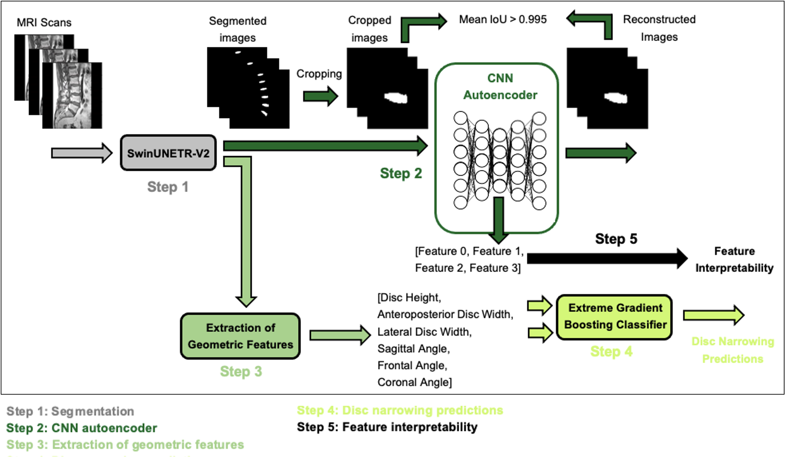

# CNN Autoencoder Feature Extraction

This repository contains the codebase for a project focused on feature extraction from lumbar spine MRI scans using a convolutional neural network (CNN)-based autoencoder. These extracted features are then used to enhance predictions of disc pathologies, such as disc narrowing. For more details, please see the [abstract](docs/abstract.pdf) (podium at ORS-PSRS 2024).

## Data
The dataset comprises 447 lumbar spine MRI scans obtained from 218 patients with a history of low back pain. While the dataset itself is not included in this repository, the expected directory structure for organizing the data is outlined in the ```data``` folder. Subfolders are designed to hold images, masks and annotations for each patient.


## Pipeline
- **Segmentation of MRI scans**:
  - Segmenting lumbar discs in MRI scans to isolate regions of interest for further analysis
- **Feature extraction**:
  - Extracting latent features from segmented MRI scans using a CNN-based autoencoder 
- **Geometric features computation**:
  - Computing disc geometry such as disc height, width and orientation
- **Disc narrowing prediction**:
  - Predicting disc narrowing by leveraging latent and geometric features
- **Feature interpretability**:
  - Analyzing the interpretability of autoencoder latent features by correlating them the extracted geometric features


<br>

<p align="center">
  
</p>

<br>


## Repository Structure

### Root Directory
- ```data```: Placeholder for input data (not included in the repository), including:
  - **annotations.xlsx**: Ground truth annotations for the dataset
  - ```images```: Input MRI scans
  - ```masks```: Corresponding masks for the input MRI scans
- ```docs```: Documentation and resources, including:
  - **abstract.pdf**: Abstract presented at the ORS 2025 annual meeting
  - **poster.pptx**: Poster presentation slide (ORS 2025)
  - **podium.pptx**: Slides for podium presentation (ORS-PSRS 2024)
- **main.ipynb**: Jupyter Notebook demonstrating the pipeline's usage
- **requirements.txt**: Python dependencies required for the project
- **.gitignore**: Specifies files and folders to exclude from version control

The ```src``` directory contains all scripts and modules for processing, analysis, and utility functions:
- **autoencoder.py**: Definition of the CNN-based autoencoder model
- **compute_geometry.py**: Computations of relevant geometric features
- **config.py**: Stores configuration constants and parameters
- **data_loader.py**: Data loading utilities for handling input datasets
- **image_generation.py**: Functions for generating images from latent features
- **image_preprocessing.py**: Preprocessing functions 
- **metrics.py**: Tools for evaluating model performance
- **model_training.py**: Training pipeline for the ML models
- **utils.py**: General-purpose helper functions

